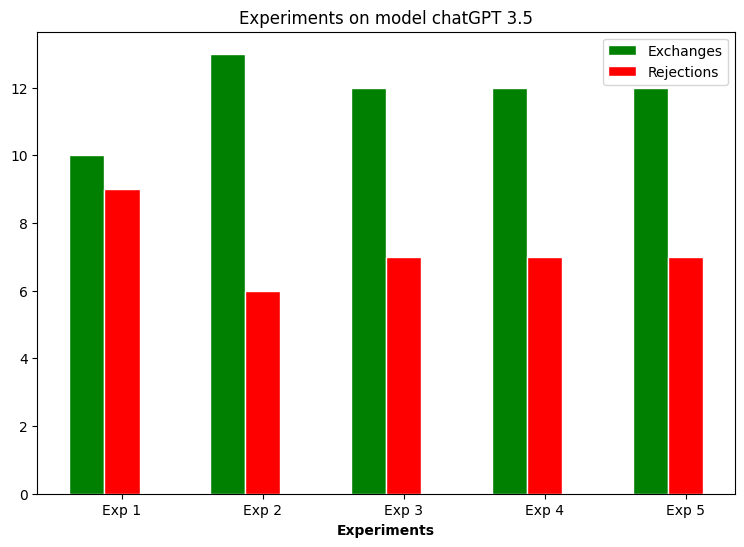

Leveraging OpenAI’s Python API, both chat (gpt-4 and gpt-3.5-turbo) and completion (text-davinci–003) models were tested. To build a profile, a LangChain SelfAskWithSearch Agent is implemented to collect relevant information about a given culture and focusing on a given set of key factors. This profile is then injected into the system prompt of the LLM, instructing it to behave according to that information. Finally, we ran a series of experiments varying model temperature from 0.1 to 2 by 0.1 and recorded the following responses by chatGPT:

